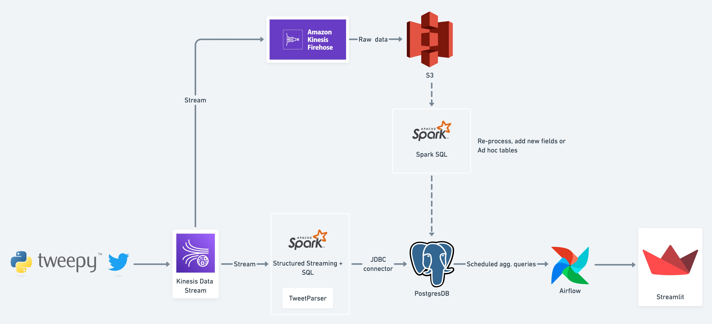

[Wordle](https://www.nytimes.com/games/wordle/index.html) puzzle game has now been around for almost a year. Since the start, it grew a lot in popularity, not only with playing it, but sparking new variations of the game. It also became an attractive topic for different data oriented projects, based on its play and results that were shared on social networks ([WordleStats](https://twitter.com/wordlestats), [What makes a Wordle word hard?](https://waldrn.com/what-makes-a-wordle-word-hard/)).

This article is based on the project done for building a data pipeline for capturing and parsing Wordle results, making them more accessible to propel further analysis on the top of it.

First, we will outline the problem we want to tackle. With the given objective of the project, together with requirements and assumptions, we will provide the high level architecture. Then, each stage will be explained to understand its purpose and what it does. Finally, a simple use case with a dashboard is provided, to get the feeling of what can be done.

Since such projects can be done on different levels and scales, some considerations for future work will be discussed in the end.


## Problem description
Let's say we just solved today's Wordle. We are the first today in our circle to solve it and are excited to share it on Twitter. While it's easy to compare it with few others later today, it would be interesting to know how good we did on a larger scale. Unfortunately, original Wordle game does not provide overall stats. It only provides a prepared message for sharing with included result, for example:

```
"Wordle 293 4/6

⬜🟨🟩🟩⬜
🟩⬜⬜⬜⬜
🟩⬜🟩🟩🟩
🟩🟩🟩🟩🟩"
```
<figcaption><i>Default format of a message for sharing Wordle result</i></figcaption>


The following information can be retrieved:
- Puzzle id (293),
- Number of attempts (4) and
- Correctness of each letter (square) in an attempt (row).

What we can do is to collect those results that are shared as public tweets. The good thing is, the format doesn't change in regards to result, only the number of attempts and the grid of squares. We would need to parse the text to retrieve all the information and translate the grid into more "measurable" values to be able to evaluate each result. Doing this on a scale, we could build a dataset to provide a service/foundation for deeper analysis of the game.

## Objective

The objective is to capture messages with Wordle daily puzzle results on Twitter and store them in a form that enables analysis and exploration of results. We will also implement one such use case to show the performance of solving the daily puzzle throughout the day.


## Requirements and Assumptions
We need to frame our solution in terms of requirements and assumptions. Requirements will be the following:

- Support (near) Real-time analytics
- Each result should contain a timestamp, puzzle id, number of attempts and correctness of each attempt
- Persistent storage for all captured tweets (non functional requirement)

 Now, let's establish few assumptions:

 - Our source will be Twitter, which will be accessed through its Stream API. We will use it inside its rate limits, which won't serve us all the data possible, but still reasonable enough for our purpose (>100k tweets/day).
- Wordle resets the puzzle every day at midnight, depending on the time zone we are at.
This means that results on Twitter could be for a different puzzle that is active in our time zone. We will simplify this and use UTC time zone, which is also used in API responses. Besides that, we will collect results only for one puzzle per day.
- We will base our proposed solution on cloud managed services wherever possible, while  for development purposes containerized versions will be used.

## High level architecture

With the objective, requirements and assumptions set, we can proceed to the architecture part.

One ingestion side, we need to design a service that continuously reads from the API, to fulfill the first part of the "near real-time" requirement. As we assumed that reads from Twitter API will be limited, our service needs to take care of filtering the stream, as well as respect usage limitations. For the next stage, we need to establish a delivery stream, to which data will be pushed and temporarily stored, before being directed further. Once ingested, we should take care of storing tweets in its raw format, to satisfy our non functional requirement. This will be achieved with storing in a data lake. Second downstream for ingested data will be the processing part. We have to take care of parsing Wordle results from tweet text and collect all values required. Since parsing text is rarely trivial, we will need to implement a parsing module to get to the results. We will store successfully processed data to a data warehouse. At this point, we need to prepare data for our analytical use case. We'll define a few aggregation queries for the collected data and run them on a regular cadence (one hour). Finally, we will build a dashboard to present our data.

As Python is our language of choice here, we will implement an ingestion service with the help of tweepy package. To deliver ingested data, we will take advantage of Amazon Kinesis services: Firehose will continually dump raw tweets to S3 bucket (data lake), while Data Stream will take care of feeding the processing downstream. We will use Spark Structured Streaming engine for processing, together with our own TweetParser module. As our data warehouse, we will use PostgresDB. Orchestrating aggregation jobs will be done with Apache Airflow. And finally, we'll use the Streamlit library to build the dashboard.



[See in Whimsical](https://whimsical.com/wordle-pulse-pipeline-design-LNV8hCKdRDbuud5q8gYR77)

*Disclaimer: Tools and services used suggest using AWS as a cloud provider. However, the choice was made purely on the previous familiarity. For projects like this, architecture is supposed to be cloud-agnostic, since all the work can be done with any of the three main providers (AWS, Azure, GCP).*

### Ingestion (Twitter Stream API & Tweepy)

Let's start with taking a closer look at our only data source. We'll access public tweets through Twitter's Stream API endpoint. We need to create a Twitter account (if you don't have one already), access [developer pages](https://developer.twitter.com/en/portal/petition/use-case) and register a new App to retrieve Access and Consumer credentials. Once we install *[tweepy](https://www.tweepy.org/)* package, we can implement the script for connecting to the API.

Stream produces a lot of noise in ingested data if we don't filter it to receive only tweets, that contain Wordle results. Therefore, we will query the stream with keyword

`Wordle {worlde_id}`,

where *wordle_id* is the number of the puzzle on the current day. For every day, we will change this number and restart the stream, to get more accurate tweets with each day. Every tweet received is read and pushed to Kinesis Data stream (more about it in the next section).

To remind ourselves here, that Twitter Stream API is fairly rate limited. With the respect to that, we will use the option to wait when we hit the limit (`wait_on_rate_limit=True`), so calls to the API will be paused temporarily, until the back-off period doesn't pass. The drawback of the Essential access API type is, that it could result in longer period, which would mean we will miss some data for a certain time frame.
Script for ingestion data from Twitter stream is available [here](https://github.com/tcufer/wordle_pulse/blob/develop/twitter_handle/stream_to_kinesis.py).


### Data streaming (Kinesis Data stream & Firehose)

Once we have established reading from Twitter Stream, we need to direct this data to consumers. [Amazon Kinesis](https://console.aws.amazon.com/kinesis/) offers a tool to work with data streams. Its feature Data streams comes with the standard attributes as other publisher/subscriber systems. 


We have to define three main parameters for setting up a new Data stream: *name*, *number of shards*, and *partition key*. A single shard has write capacity of 1MiB/sec and 1k records/sec, and read capacity of 2MiB/sec. Since we are already limited with Twitter API rate, having one shard meets our needs here. When initializing connection to Kinesis in the previous part, we also had to define a partition key, which should reflect the number of shards. Since we have only one shard, all records will end up in the same partition, so the partition key can be any Unicode string of 256 characters.


For streaming data sources, it is usually beneficial to store data in its raw format in a data lake.. Doing so, makes it possible to re-process later, if requirements of our use case change or to perform ad-hoc queries for different purposes. With Kinesis Firehose, we can create a delivery stream and store every ingested tweet that comes into S3 bucket.

Configuration for Firehose doesn't require much input: we need to define the source (Data stream) and destination (S3 bucket). We already created a Data stream, so what is left is to create a new bucket for all our data. Additionally, Firehose provides transform functionalities (eg. calling external Lambda functions, compression, encryption), which we could perform on data before storage. Originally, Twitter API returns JSON objects and we will keep it this way, although storing them in eg. Parquet format is typically more efficient for querying.

Kinesis services are easy to configure through the AWS Web console. For this part of the project, we defined everything needed with Terraform ([source](https://github.com/tcufer/wordle_pulse/tree/develop/kinesis_ds_firehose)).

### Processing (Spark Structured Streaming)

Our main goal at the processing stage is to parse tweet's text as they come in, filter out those that don't contain Wordle results and write them to the table in our data warehouse (PostgresDB). [Spark Structured streaming](https://spark.apache.org/docs/latest/structured-streaming-programming-guide.html) provides a scalable and fault-tolerant stream processing engine, where we can leverage SQL in the same way we would do on the batches of static data.

On the input, we receive a stream of tweets in the form of JSON objects.  Our focus will be on the message field, where we will look for the result of the Wordle puzzle. Let's look at the example of a result again:

```
"Wordle 293 4/6

⬜🟨🟩🟩⬜
🟩⬜⬜⬜⬜
🟩⬜🟩🟩🟩
🟩🟩🟩🟩🟩"
```
As we already mentioned, we can retrieve puzzle id, number of attempts and correctness of each letter in an attempt from the text. It can be still modified before posting, but we will recognise this pattern only (with allowing some text before and after), which should not cause too much regression on the parsing part.

It means we need to parse a plain text and retrieve the above mentioned information. While the first two are easy to parse, we need a bit more effort to parse the grid of squares into numerical representation.

We will introduce the following mapping of squares: 0 - empty, 1 - yellow, 2 - green. This will help us calculate the completeness in each attempt, if we decide to compare individual attempts.


We'll implement a [TweetParser](https://github.com/tcufer/wordle_pulse/blob/develop/spark/src/tweet_parser.py) class that takes the tweet text as an input and returns all three values if parsed successfully. In Spark, we will invoke this through SQL *udf* (user defined function), which provides similar functionality as functions we can define in RDBMS databases. The example message above would be translated to:

```
{
	"attempts_count": 4,
	"wordle_id": "293",
	"attempts": {
		"1": [0, 1, 2, 2, 0],
		"2": [2, 0, 0, 0, 0],
		"3": [2, 0, 2, 2, 2],
		"4": [2, 2, 2, 2, 2]
	}
}
```

Attempts are represented with another JSON, where keys represent rows and value is an array of numerical values instead of squares.

Row that is written in the table is the following has the following format:

```
id: 123123,
created_at: "2022-04-07 23:15:14",
processed_at: "2022-04-07 23:16:30",
user_id: "987654321",
wordle_id: "293",
attempts_count: 4,
message: "Wordle 293 4/6

⬜🟨🟩🟩⬜
🟩⬜⬜⬜⬜
🟩⬜🟩🟩🟩
🟩🟩🟩🟩🟩",
attempts: {"1": [0, 1, 2, 2, 0], "2": [2, 0, 0, 0, 0], "3": [2, 0, 2, 2, 2], "4": [2, 2, 2, 2, 2]}
```


Because we are mostly interested in puzzle results, we left out most of the user data from tweets. We kept tweet id and user id so results can be referenced to original tweets. With the proposed format of the row, we hit the requirement for the expected result format we want to store.


Parsing records as we do here, inevitably introduces additional regression and discards some results. To understand the proportion of it, we could introduce [accumulator](https://spark.apache.org/docs/latest/api/python/reference/api/pyspark.Accumulator.html) variable to measure success of the parser or add another sink, to which we would write records that didn't get parsed, so we can analyze them and continually improve our process.

#### Postgres

Postgres is a widely used open-source RDBMS, but it's common to be used as an OLAP database as well. [Amazon Aurora](https://aws.amazon.com/rds/aurora/) offers managed Postgres database service, which will be a choice for our case. When developing this project, we used a dockerized version to avoid otherwise costly service.

### Orchestrating timely aggregations (Airflow)

Now that we have established the stream and processed data is already loading to the warehouse, we should turn towards the use case.

We will use Apache Airflow for orchestrating aggregation tasks. Since we only have one table and need no external sources, our DAG will be rather simple. DAG will be scheduled hourly, to do calculations for the past hour. We need to take care of the edge case here, where records produced by a task, run at midnight, count for the previous day. Since the Wordle puzzle is different for each day, aggregations should also be done on results of the puzzle for that day.


Besides counts of results found in the last hour and up to each hour, we could track distribution of score (number of attempts needed) and how unique results are in terms of attempts taken. Aggregations for each metric will be stored in separate tables:

- `stats_hourly`, for simple counts of all and unique results found in the last hour and by then
- `stats_hourly_most_common_results`, for 5 most common results (grids) in the last hour
- `stats_hourly_results_distribution`, for distribution of score in the last hour


### Results (Streamlit Dashboard)

With building a simple dashboard, we can show some characteristics of Wordle puzzle results. [Streamlit](https://streamlit.io/) is a powerful, open-source Python library, for creating rich user interfaces and data visualizations, especially when our front-end knowledge is limited. With presenting data from aggregation tables, we can already provide few insights, without performing expensive querying on all results:

- comparison of the number of all results and unique results throughout the day
- distribution of attempts (scores) in the last hour
- most common results (paths) in the last hour

Live Demo dashboard is available here: [http://ec2-3-126-209-227.eu-central-1.compute.amazonaws.com:8000/](http://ec2-3-126-209-227.eu-central-1.compute.amazonaws.com:8000/)

## Conclusion

In this post, we showed how to design and build an end-to-end data pipeline for processing data from Twitter stream to propel a certain use case. Clarifying the objective, requirements and exposing a few assumptions, helped us design the high level architecture and choose the tools needed.
In general sense, projects like this serve to support extracting value from data, which is exciting for different ideas or organizations, but it also comes with various challenges regarding data management and processes around it.

### Self reported data and accuracy of results

Wordle itself does not provide its own source for showing all results. We only operate on a subset of data, that is self reported by players, who happen to be Twitter users as well. Text tweets can't be checked, if someone actually played the game or just wrote the text that looks like the one Wordle prepares for sharing.

So, to measure actual performance of solving Wordle more accurately, we would need to capture more than just results on social media. Our source is already biased by just those results that were published. We also don't know if the difficulty of the puzzle affects the total number of results shared. Finally, we also consider just tweets, which we successfully parsed, which adds some more regression in the final dataset.

As already mentioned in the Ingestion part, as our main source can limit reading rates aggressively, if our stream produces a lot of traffic and we don't take care of narrowing it down with filtering. Few such occurrences are visible on the Demo dashboard for the windows at 2022-04-06 12:00:00, 2022-04-07 13:00:00 and 2022-04-07 14:00:00. For these periods, we were unable to receive tweets.

### Infrastructure considerations, scalability and costs

When designing this project, we decided to go with fully managed cloud services instead of self managed solutions. This reduced the infrastructure overhead and accelerated the development cycle. Scaling also gets into a domain of the cloud provider, so the efforts can be directed into development.  

With all the advantages that managed services offer, financial costs should be taken into consideration, when deploying such projects. Costs of running eg. Spark cluster (Amazon EMR) or managed Postgres database (Amazon Aurora) tend to rise fast.
